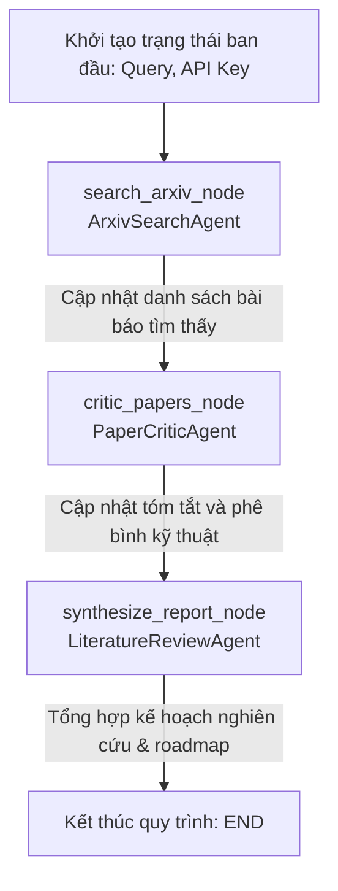
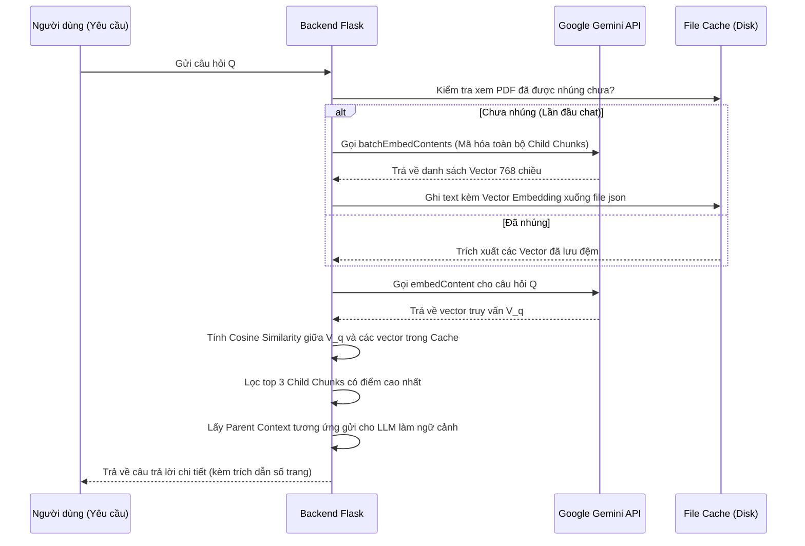

# BÁO CÁO PHÂN TÍCH KỸ THUẬT HỆ THỐNG AI (AI SYSTEM TECHNICAL DOCUMENTATION)
**Đề tài:** Hệ thống Trợ lý Nghiên cứu Khoa học Thông minh và Cá nhân hóa (Scholar Inbox)
**Đối tượng báo cáo:** Giảng viên hướng dẫn / Hội đồng Khoa học
**Tác giả:** Nhóm Phát triển Dự án LLM_PRO

---

## TÓM TẮT HỆ THỐNG (SYSTEM OVERVIEW)
Hệ thống sử dụng các kỹ thuật Học máy (Machine Learning) và Xử lý ngôn ngữ tự nhiên (NLP) tiên tiến để xây dựng một quy trình khép kín hỗ trợ nhà nghiên cứu:
1. **Kiến trúc Đa tác tử (Multi-Agent Architecture):** Sử dụng **LangGraph** để xây dựng quy trình tìm kiếm, phê bình và tổng hợp tài liệu khoa học tự động.
2. **Hệ thống RAG Lai (Hybrid RAG System):** Sử dụng Google **`text-embedding-004`** kết hợp cơ chế kiểm nhớ đệm (disk-cache) và tìm kiếm ngữ nghĩa (Semantic Cosine Similarity) song song với cơ chế tìm kiếm từ khóa (TF-IDF) dự phòng.
3. **Phân cụm Không gian Học thuật & Học chủ động (Scholar Map & Active Learning):** Áp dụng thuật toán **t-SNE** để giảm chiều dữ liệu biểu diễn các bài báo từ không gian vector 768 chiều xuống không gian 2D, kết hợp cơ chế học chủ động (Active Learning) để tối ưu hóa ranh giới phân loại theo sở thích người dùng.
4. **Giải thích Gợi ý Cá nhân hóa:** Sử dụng mô hình LLM lớn (Gemini 2.5 Flash / Llama 3.3) để sinh tóm tắt thích ứng và lý do gợi ý tự động dưới cấu trúc dữ liệu JSON nghiêm ngặt.

---

## 1. KIẾN TRÚC ĐA TÁC TỬ (MULTI-AGENT WORKFLOW WITH LANGGRAPH)

Hệ thống điều phối luồng công việc thông qua một Đồ thị trạng thái có định hướng (Directed Acyclic Graph - DAG) được xây dựng trên thư viện **LangGraph**. Trạng thái chung của hệ thống được định nghĩa qua lớp cấu trúc dữ liệu `AgentState`.



### 1.1 Chi tiết các Node tác tử (Agent Nodes)
*   **ArxivSearchAgent (`search_arxiv_node`):**
    *   **Nhiệm vụ:** Thực hiện tìm kiếm hỗn hợp (Hybrid Search) trên cơ sở dữ liệu bài báo cục bộ dựa trên truy vấn người dùng.
    *   **Thuật toán Cá nhân hóa (Personalization Boost):** Điểm số cuối cùng của một tài liệu ứng viên được tính bằng công thức:
        $$\text{Score}_{\text{final}} = \text{Similarity}_{\text{TF-IDF}} \times \left(1.0 + 0.15 \times \text{Count}_{\text{upvoted\_category}}\right)$$
        *Trong đó:* $\text{Count}_{\text{upvoted\_category}}$ là số lượng bài báo cùng phân loại (category) mà người dùng đã nhấn Thumbs Up trong lịch sử. Điều này giúp nâng cao thứ hạng các bài báo thuộc lĩnh vực người dùng quan tâm.
*   **PaperCriticAgent (`critic_papers_node`):**
    *   **Nhiệm vụ:** Đọc song song các đoạn trích của các bài báo được lựa chọn từ Agent trước, khai thác cấu trúc thuật toán, các thông số huấn luyện (learning rate, batch size, epochs), các tập dữ liệu benchmark, và các giới hạn khoa học (scientific constraints).
    *   **Tối ưu hiệu năng:** Chạy đa luồng song song (`concurrent.futures.ThreadPoolExecutor`) đối với mỗi bài báo để giảm thiểu tối đa thời gian gọi API LLM.
*   **LiteratureReviewAgent (`synthesize_report_node`):**
    *   **Nhiệm vụ:** Nhận đầu vào là các bản phê bình chi tiết từ `PaperCriticAgent`, tổng hợp thành một báo cáo khoa học Lộ trình Nghiên cứu (Research Roadmap) hoàn chỉnh bằng tiếng Việt với kế hoạch phân rã 3 giai đoạn (Phased Plan), bảng mốc thời gian (Milestone Timeline) và đánh giá rủi ro phần cứng/phần mềm kỹ lưỡng.

---

## 2. HỆ THỐNG TRÍCH XUẤT THÔNG TIN LAI & VECTOR EMBEDDING (HYBRID RAG SYSTEM)

Để hỗ trợ chat hỏi đáp trực tiếp trên nội dung file PDF của bài báo khoa học, Scholar Inbox xây dựng một đường ống (pipeline) RAG hiệu năng cao:

### 2.1 Cơ chế Phân đoạn Văn bản phân cấp (Hierarchical Parent-Child Chunking)
Để đảm bảo LLM nhận được ngữ cảnh rộng (Parent Context) trong khi thuật toán tìm kiếm vector hoạt động trên phân đoạn nhỏ có độ chính xác cao (Child Chunk), hệ thống áp dụng cơ chế phân đoạn kép:
1.  **Parent Chunks:** Cắt văn bản thô từ trang PDF với kích thước $1500$ ký tự, độ chồng lấp (overlap) $300$ ký tự.
2.  **Child Chunks:** Chia nhỏ hơn nữa với kích thước $300$ ký tự, độ chồng lấp $50$ ký tự. Mỗi Child Chunk giữ một liên kết tham chiếu ngược tới Parent Chunk chứa nó.

### 2.2 Quy trình Mã hóa và Tìm kiếm Ngữ nghĩa Hỗn hợp (Hybrid Retrieval Process)



*   **Tính toán Khoảng cách Vector (Cosine Similarity):**
    Khoảng cách cosine giữa vector truy vấn $\mathbf{u}$ (câu hỏi) và vector phân đoạn $\mathbf{v}$ (Child Chunk) được tính bằng công thức:
    $$\text{Cosine Similarity}(\mathbf{u}, \mathbf{v}) = \frac{\mathbf{u} \cdot \mathbf{v}}{\|\mathbf{u}\| \|\mathbf{v}\|} = \frac{\sum_{i=1}^{n} u_i v_i}{\sqrt{\sum_{i=1}^{n} u_i^2} \sqrt{\sum_{i=1}^{n} v_i^2}}$$
*   **Cơ chế Dự phòng Lexical Fallback:** 
    Nếu API Key chưa được cấu hình hoặc lỗi mạng, hệ thống tự động khởi chạy bộ mã hóa từ khóa **TF-IDF (`TfidfVectorizer`)** cục bộ trên RAM để tính toán cosine similarity thay thế, đảm bảo hệ thống không bao giờ bị gián đoạn.

---

## 3. PHÂN CỤM HỌC THUẬT 2D & HỌC CHỦ ĐỘNG (SCHOLAR MAPS & ACTIVE LEARNING)

Để cung cấp một bản đồ nghiên cứu trực quan cho người dùng, hệ thống thực hiện biểu diễn các tài liệu trên một không gian phẳng 2D thông qua kỹ thuật giảm chiều phi tuyến.

### 3.1 Trực quan hóa bản đồ bằng thuật toán t-SNE
*   **Thuật toán:** Hệ thống sử dụng **t-Distributed Stochastic Neighbor Embedding (t-SNE)** để ánh xạ các vector đặc trưng của bài báo từ không gian embeddings 768 chiều xuống tọa độ $(x, y)$ trên canvas 2D.
*   **Cơ chế:** t-SNE bảo toàn cấu trúc lân cận cục bộ (local structure), nghĩa là các bài báo có nội dung học thuật tương đồng nhau sẽ tụ lại thành các cụm (cluster) có màu sắc đại diện cho phân loại (CV, NLP, ML, AI).

### 3.2 Tối ưu hóa ranh giới phân loại bằng Học chủ động (Active Learning)
*   **Vấn đề:** Để phân loại nhanh chóng sở thích của người dùng đối với hàng ngàn bài báo mới mà không bắt người dùng đánh giá thủ công toàn bộ dữ liệu.
*   **Giải pháp:** Áp dụng mô hình Học chủ động (Active Learning). Hệ thống phân tích ranh giới phân loại (decision boundary) hiện tại và tìm ra các điểm bài báo nằm sát đường biên phân loại nhất (các tài liệu có độ không chắc chắn cao nhất - Uncertainty Sampling).
*   **Quy trình tương tác:** Gợi ý các bài báo vùng biên này trong sidebar **Active Learning** để người dùng nhấn Thumbs Up/Down. Chỉ cần vài lượt dán nhãn từ người dùng, hệ thống lập tức tối ưu hóa được ranh giới phân loại trên toàn bộ không gian dữ liệu.

---

## 4. HỆ THỐNG GỢI Ý CÁ NHÂN HÓA VỚI ĐỊNH DẠNG DỮ LIỆU JSON CHUẨN

*   **API Routing:** Khi người dùng mở trang chi tiết hoặc hover một tài liệu đề xuất, backend Flask gọi API giải thích gợi ý (`/api/explain`).
*   **JSON Schema Enforcement:** Để tránh các lỗi phân tách ký tự gây vỡ giao diện (UI crash), hệ thống yêu cầu mô hình LLM (Gemini hoặc Llama 3.3) trả về dữ liệu tuân thủ nghiêm ngặt định dạng JSON định sẵn thông qua tham số cấu hình:
    *   *Gemini:* Sử dụng cấu hình thuộc tính `responseMimeType: "application/json"` đi kèm `responseSchema`.
    *   *Groq Llama:* Sử dụng tham số `response_format: {"type": "json_object"}`.
*   **Cấu trúc dữ liệu JSON đầu ra:**
    ```json
    {
      "explanation": "Lời giải thích cá nhân hóa ngắn gọn lý do bài báo phù hợp với sở thích của người dùng.",
      "tailored_summary": "Tóm tắt bài báo được viết riêng dựa trên các khái niệm mà người dùng quan tâm."
    }
    ```

---

## KẾT LUẬN VÀ KIẾN NGHỊ KHOA HỌC (CONCLUSION)
Hệ thống **Scholar Inbox** là sự kết hợp chặt chẽ giữa các thành phần ML truyền thống và các công nghệ sinh học đột phá hiện nay (Generative AI). Việc chuyển đổi thành công sang kiến trúc **Multi-Agent** kèm **Semantic Embedding RAG** đảm bảo hệ thống có độ tin cậy và chất lượng học thuật cao nhất, phục vụ tốt cho các nhu cầu nghiên cứu chuyên nghiệp.
