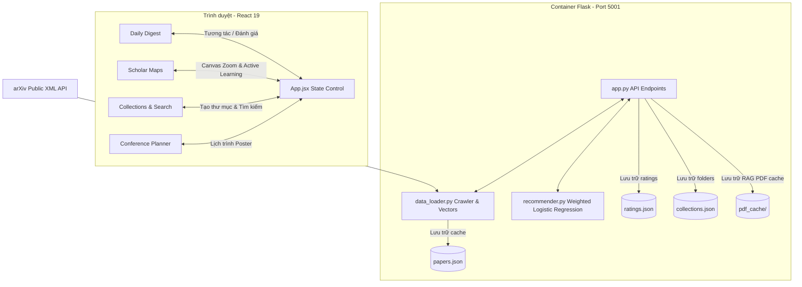

# Tài liệu Kiến trúc Kỹ thuật và Đặc tả Mã nguồn Scholar Inbox

Tài liệu này cung cấp đặc tả chi tiết về kiến trúc phần mềm, luồng dữ liệu, các công thức toán học cốt lõi và các sơ đồ JSON API phục vụ cho việc phát triển và duy trì hệ thống Scholar Inbox.

---

## 1. Tổng quan Kiến trúc và Luồng Dữ liệu

Hệ thống được thiết kế theo mô hình Client-Server độc lập, đóng gói hoàn toàn trong Docker. Cổng kết nối của Backend được điều chỉnh sang cổng 5001 trên máy chủ để tránh xung đột trên hệ điều hành macOS.



### Luồng vận hành:
1. **Ingestion (Thu thập dữ liệu)**: Backend tải về 200 bài báo từ arXiv, trích xuất tiêu đề, abstract, thông tin tác giả và tạo ma trận TF-IDF.
2. **Dimension Reduction (Giảm chiều dữ liệu)**: Thuật toán t-SNE chiếu ma trận vector về không gian 2 chiều (X, Y) và gửi sang Frontend trình diễn.
3. **Recommendation (Gợi ý cá nhân hóa)**: Khi người dùng đánh giá Upvote/Downvote, Backend huấn luyện lại mô hình Logistic Regression và tính lại Relevance Score cho toàn bộ bài báo.

---

## 2. Cấu trúc thư mục (Project Structure)

```text
/LLM_PRO
├── Dockerfile                  # Chỉ thị Docker build cho React Frontend
├── README.md                   # Tài liệu hướng dẫn khởi chạy nhanh
├── TECHNICAL.md                # Tài liệu chi tiết kiến trúc & toán học (Tệp này)
├── docker-compose.yml          # Phối hợp khởi động container Frontend & Backend
├── index.html                  # HTML gốc chứa SEO Meta-tags
├── package.json                # Danh sách thư viện phụ thuộc của React Frontend
├── vite.config.js              # Cấu hình Vite dev server và build
├── src/                        # Mã nguồn React Frontend
│   ├── App.jsx                 # Central State Controller, điều phối API calls
│   ├── index.css               # Hệ thống CSS biến dark-mode và hiệu ứng glassmorphic
│   ├── main.jsx                # Entrypoint của React DOM
│   └── components/             # Các view thành phần
│       ├── DailyDigest.jsx     # Card bài báo, highlight abstract, modal PDF, sidebar RAG Chat
│       ├── ScholarMap.jsx      # Science Map vẽ bằng Canvas 2D, zoom nấc, Active Learning
│       ├── Collections.jsx     # Tìm kiếm prefix-match, quản lý thư mục và gợi ý centroid
│       ├── ConferencePlanner.jsx # Xếp hạng phiên poster, lịch trình cá nhân
│       └── ResearchWorkspace.jsx # Giao diện tab làm việc Multi-Agent quan sát log thời gian thực
└── backend/                    # Mã nguồn Python Backend
    ├── Dockerfile              # Docker build cho Flask Backend
    ├── app.py                  # API endpoints, định tuyến các truy vấn phục vụ hệ thống
    ├── data_loader.py          # Tải arXiv XML, regex highlights, TF-IDF, t-SNE reduction
    ├── recommender.py          # Custom weighted Logistic Regression model
    ├── llm_helper.py           # Kết nối Gemini API, bộ truy vấn embedding và heuristics
    ├── agent_orchestrator.py   # Đồ thị trạng thái LangGraph Multi-Agent, search, critic, synthesizer
    ├── requirements.txt        # Thư viện Python (flask, flask-cors, numpy, scikit-learn, pypdf, langgraph)
    ├── test_recommender.py     # Kịch bản test toán học hệ thống đề xuất
    ├── test_llm.py             # Kịch bản test gợi ý trích lọc heuristics/Gemini
    ├── test_rag.py             # Kịch bản test engine phân đoạn cắt chunk RAG PDF
    ├── test_agents.py          # Kịch bản test hệ thống Multi-Agent LangGraph
    └── pdf_cache/              # Thư mục cache văn bản PDF từ arXiv phục vụ RAG
```

---

## 3. Thuật toán đề xuất cá nhân hóa (Recommender Mathematics)

Để giải quyết bài toán mất cân bằng dữ liệu giữa số lượng ít upvote ($n_P$) và kho dữ liệu rất lớn, đề tài đề xuất hệ thống Weighted Binary Cross-Entropy Loss:

### 3.1 Công thức Loss function
$$L = \frac{1}{n_T} \sum_{i=1}^{n_T} -w_i \left[ y_i \log \hat{y}_i + (1 - y_i) \log (1 - \hat{y}_i) \right]$$

Trong đó:
*   $n_T = n_P + n_N + n_R$: Tổng số lượng mẫu đưa vào huấn luyện.
*   $n_P$: Số lượng bài báo được Upvote.
*   $n_N$: Số lượng bài báo được Downvote (Explicit negatives).
*   $n_R$: Mẫu âm ngẫu nhiên lấy từ tập chưa đánh giá để cân bằng ranh giới (Random negatives).
*   $\hat{y}_i$: Xác suất mô hình dự đoán người dùng thích bài viết thứ $i$.
*   $w_i$: Trọng số phạt tương ứng của mẫu.

### 3.2 Tính toán trọng số phạt (Sample Weights)
Trọng số trung gian được cân bằng theo tỷ lệ:
$$\tilde{w}_P = \frac{1}{n_P}$$
$$\tilde{w}_N = \frac{S \cdot V}{V \cdot n_N + (1 - V) n_R}$$
$$\tilde{w}_R = \frac{S \cdot (1 - V)}{V \cdot n_N + (1 - V) n_R}$$

Trình hiệu chỉnh độ lệch (Bias Correction) bằng cách nhân với tổng số mẫu $n_T$:
$$w_P = n_T \tilde{w}_P, \quad w_N = n_T \tilde{w}_N, \quad w_R = n_T \tilde{w}_R$$

### 3.3 Tham số tiêu chuẩn
*   $C = 0.1$: Biên chuẩn hóa L2 giúp tránh overfitting khi có ít lượt ratings từ người dùng.
*   $V = 0.8$: Tỷ lệ ưu tiên mẫu âm tường minh (explicit negatives). Downvote càng nhiều thì độ quan trọng của explicit negatives càng làm lu mờ random negatives.
*   $S = 5.0$: Hệ số làm mất cân bằng phạt mẫu âm so với mẫu dương.

---

## 4. Các Thuật toán Tối ưu hóa Nâng cao

### 4.1 Thuật toán RAG PDF Phân cấp và Tìm kiếm Ngữ nghĩa (Hierarchical Neural RAG)
*   **Vấn đề**: Việc cắt văn bản thô theo độ dài tĩnh có thể làm gãy các cụm từ kỹ thuật hoặc công thức toán học.
*   **Giải pháp**:
    - **Phân đoạn văn bản phân cấp**:
        - *Mảnh con (Child Chunks - 300 ký tự, overlap 50)*: Dùng để tính toán độ tương đồng vector chính xác với câu hỏi.
        - *Mảnh cha (Parent Chunks - 1500 ký tự, overlap 300)*: Chứa đựng và bao quanh mảnh con tương ứng, cung cấp ngữ cảnh đầy đủ cho LLM.
    - **Vector Embedding**: Mã hóa các Child Chunks thành các vector 768 chiều bằng mô hình **Google `text-embedding-004`**.
    - **Tối ưu hóa mạng (Batching & Caching)**:
        - Sử dụng cơ chế nhúng hàng loạt `batchEmbedContents` để gửi tối đa 50 phân đoạn trong một yêu cầu duy nhất, giảm 90% độ trễ kết nối.
        - Lưu trữ (cache) các vector nhúng cùng văn bản phân đoạn vào ổ cứng (`backend/pdf_cache/<paper_id>.json`).
        - Lần truy vấn sau chỉ cần tải file cache lên RAM và tính toán Cosine Similarity trực tiếp.
    - **Lexical Fallback (Dự phòng từ vựng)**: Hệ thống tự động chuyển sang TF-IDF làm dự phòng cục bộ khi API Key gặp lỗi hoặc hết hạn ngạch.
*   **Luồng vận hành**:
    1. Câu hỏi người dùng được nhúng thành vector truy vấn $\mathbf{u}$.
    2. So khớp vector truy vấn $\mathbf{u}$ với các vector Child Chunks $\mathbf{v}$ trong cache bằng **Cosine Similarity**:
       $$\text{Cosine Similarity}(\mathbf{u}, \mathbf{v}) = \frac{\mathbf{u} \cdot \mathbf{v}}{\|\mathbf{u}\| \|\mathbf{v}\|}$$
    3. Lọc ra top 3 Child Chunks có điểm số cao nhất, trích xuất Parent Chunks tương ứng làm ngữ cảnh.
    4. Trích xuất chỉ số trang (page index) tương ứng từ dữ liệu nguồn để hiển thị trích dẫn trực tiếp trong câu trả lời.

### 4.2 Kiến trúc Đồ thị Multi-Agent với LangGraph
*   **Đồ thị LangGraph**: Điều phối luồng Literature Review bằng đồ thị trạng thái tuần tự và song song:
    - *ArxivSearchAgent*: Khảo sát từ khóa, tính điểm cá nhân hóa dựa trên lịch sử upvotes.
    - *PaperCriticAgent*: Chạy đa luồng song song (`ThreadPoolExecutor`) phân tích toán học, siêu tham số và hạn chế của các bài báo được chọn.
    - *LiteratureReviewAgent*: Tổng hợp lộ trình thực nghiệm tiếng Việt (Phased Technical Plan), bảng Timeline và giải pháp rủi ro.

### 4.3 Bộ Biên dịch Markdown-to-JSX trên Frontend
*   Frontend xây dựng hàm tự dịch `renderMarkdown` và `parseBoldText` để phân tích văn bản markdown của LLM thành các tiêu đề `<h2>`/`<h3>`/`<h4>`, danh sách bullet, và dựng bảng HTML Table đồng bộ với giao diện Glassmorphism của hệ thống.

### 4.4 Thuật toán Học chủ động Đa dạng (K-Means Diversity Active Learning)
*   **Vấn đề**: Các bài báo gần ranh giới quyết định ($w^T x + b \approx 0$) thường rất giống nhau do nằm cùng một cụm chủ đề, gây lặp lại khi hiển thị 5 bài khảo sát.
*   **Giải pháp**:
    1. Lọc ra Top 20 bài báo chưa đánh giá gần ranh giới quyết định nhất.
    2. Chạy thuật toán phân cụm **K-Means ($k=5$)** trên tọa độ 2D t-SNE ($x, y$) của 20 bài báo này.
    3. Trong mỗi cụm, lấy ra bài báo gần tâm cụm (centroid) nhất làm đại diện để trả về cho người dùng.
*   **Kết quả**: 5 bài khảo sát sẽ thuộc về 5 vùng chủ đề khác nhau trên bản đồ, giúp cập nhật nhanh nhất sở thích đa chiều của người dùng.

---

## 5. Đặc tả đặc điểm và JSON Schema API Endpoints

### 5.1 GET /api/papers
Trả về toàn bộ danh sách các bài báo kèm thông tin phân tích tọa độ t-SNE và điểm liên quan.
*   **Request**: None.
*   **Response JSON Schema**:
    ```json
    {
      "papers": [
        {
          "id": "2606.28323",
          "arxiv_url": "https://arxiv.org/abs/2606.28323",
          "title": "DexCompose: Reusing Dexterous Policies...",
          "abstract": "Dexterous manipulation policies can solve...",
          "authors": ["Dihong Huang", "Zhenyu Wei"],
          "published": "2026-06-29",
          "primary_category": "cs.LG",
          "category_name": "Machine Learning",
          "highlight": "By separating grasp preservation from...",
          "bibtex": "@article{huang2026dexcompose,\n  author = ...}",
          "x": -12.4,
          "y": 45.2,
          "relevance_score": 0.0
        }
      ]
    }
    ```

### 5.2 POST /api/rate
Ghi nhận lượt upvote/downvote và cập nhật mô hình đề xuất cá nhân hóa.
*   **Request JSON Schema**:
    ```json
    {
      "paper_id": "2606.28323",
      "rating": 1
    }
    ```
    *Ghi chú: rating = 1 (Upvote), -1 (Downvote).*
*   **Response JSON Schema**:
    ```json
    {
      "status": "success",
      "papers": [ ... ]
    }
    ```

### 5.3 POST /api/explain
Sinh lời giải thích cá nhân hóa lý do bài báo được đề xuất cho người dùng.
*   **Request JSON Schema**:
    ```json
    {
      "paper_id": "2606.28323",
      "api_key": "YOUR_GEMINI_API_KEY_OPTIONAL"
    }
    ```
*   **Response JSON Schema**:
    ```json
    {
      "reason": "Bài báo này tập trung vào prestrained policy reuse, rất phù hợp với quan tâm của bạn về Reinforcement Learning và robot control...",
      "key_points": [
        "Giới thiệu framework DexCompose",
        "Đạt hiệu suất 77.4% trên 16 composite tasks"
      ],
      "source": "Gemini LLM"
    }
    ```

### 5.4 POST /api/chat-pdf
Thực hiện truy vấn RAG hỏi đáp dựa trên nội dung PDF của bài báo.
*   **Request JSON Schema**:
    ```json
    {
      "paper_id": "2606.28323",
      "question": "What is the primary method proposed for multi-task manipulation?",
      "api_key": "YOUR_GEMINI_API_KEY_OPTIONAL"
    }
    ```
*   **Response JSON Schema**:
    ```json
    {
      "answer": "The primary method proposed is DexCompose, which uses role-aware finger ownership...",
      "retrieved_chunks": [
        {
          "child_text": "study multi-stage dexterous manipulation...",
          "text": "The third direction exploits multi-finger hands...",
          "page_idx": 3,
          "score": 0.174
        }
      ]
    }
    ```

### 5.5 POST /api/agent/chat
Kích hoạt đồ thị tác tử LangGraph để làm Literature Review.
*   **Request JSON Schema**:
    ```json
    {
      "query": "Sequential dexterity and pretrained policies",
      "api_key": "YOUR_GEMINI_API_KEY_OPTIONAL"
    }
    ```
*   **Response JSON Schema**:
    ```json
    {
      "report": "# Literature Review: Sequential dexterity...\n## 1. Introduction...",
      "logs": [
        {
          "agent": "ArxivSearchAgent",
          "message": "Analyzing query keywords..."
        },
        {
          "agent": "PaperCriticAgent",
          "message": "Analyzing methodology..."
        }
      ]
    }
    ```

---

## 6. Cơ chế Hoạt động của Frontend React

### 6.1 Interactive 2D Canvas Scatterplot (`ScholarMap.jsx`)
*   Sử dụng Canvas 2D vì số lượng điểm lớn để tối ưu hiệu năng render. Tích hợp các event handlers:
    - `onMouseDown` và `onMouseMove`: Tính toán độ lệch tọa độ delta để dịch chuyển offset bản đồ (pan).
    - `onWheel`: Cập nhật mức tỉ lệ zoom và dịch chuyển map-center tương ứng để giữ nguyên điểm focus của chuột.
*   **Dynamic Hierarchy Labels (Nhãn phân cấp động)**: Tính toán tọa độ trung vị của từng phân vùng các categories. Tùy thuộc vào tỉ lệ phóng to `zoomScale`, Frontend sẽ hiển thị:
    - Zoom thấp (< 1.5): Hiển thị ngành lớn (`category_name` như "Computer Vision").
    - Zoom trung bình (1.5 - 3.5): Hiển thị các cụm phân vùng chi tiết hơn.
    - Zoom cao (> 3.5): Hiển thị tiêu đề chi tiết của từng bài báo.

### 6.2 Offline Fallback prefix matching (`Collections.jsx` và `app.py`)
Để đảm bảo tính năng tìm kiếm hoạt động ổn định cả khi mạng chậm hoặc mất kết nối, phần mềm thiết lập cơ chế so khớp tiền tố thông qua Regex ranh giới từ.
*   Từ khóa truy vấn được tách chữ: `queryWords = query.toLowerCase().split(' ').filter(Boolean)`.
*   Biểu thức chính quy được biên soạn: `new RegExp('\\b' + escapedWord)`. Giúp loại trừ các kết quả khớp từ con không mong muốn (ví dụ: gõ `"ch"` sẽ không map phạm vi từ `"technology"`).

### 6.3 Giao diện Tab AI Research Workspace (`ResearchWorkspace.jsx`)
*   Giao diện giúp người dùng trực tiếp tương tác và quan sát hành vi suy nghĩ, ra quyết định của hệ thống Multi-Agent:
    - **Panel giám sát log (Agent Execution Monitor)**: Hiển thị từng dòng log được đẩy ra từ trường `logs` của LangGraph phục vụ tính minh bạch của quy trình.
    - **Khung preview Literature Review**: Trình bày trực tiếp báo cáo đã biên dịch Markdown, đi kèm nút copy nhanh vào clipboard.
